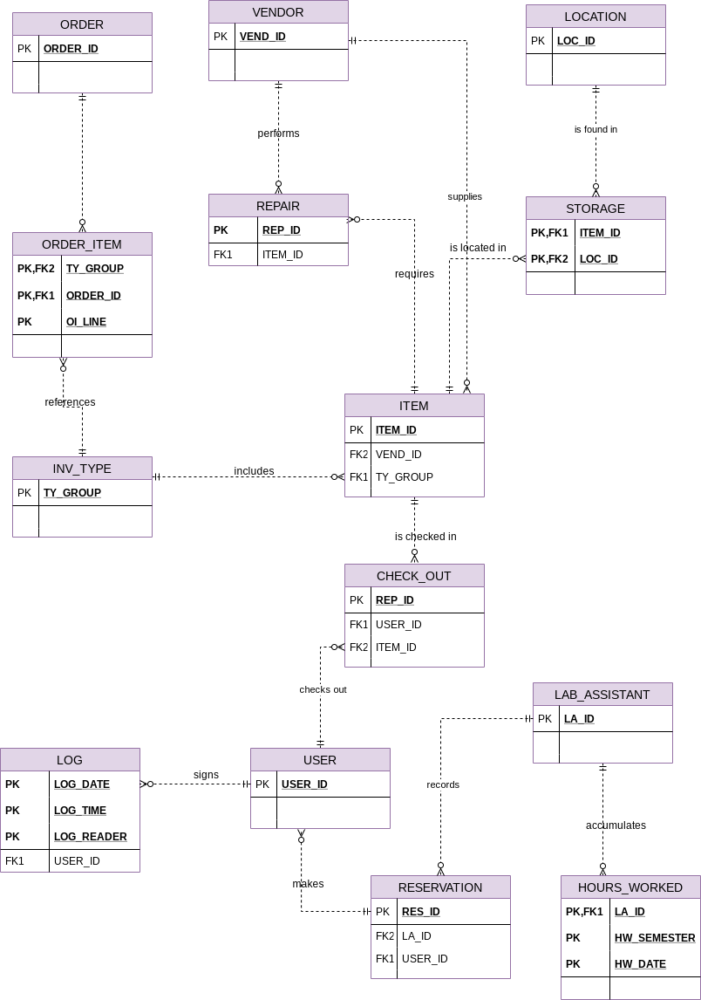

# Conceptual Design

#### Entities Based On Initial Study

    - User : User data: includes administration, faculty, and students

    - LAB_ASSISTANT : Lab assistant data: includes graduate assistants

    - WORK_SCHEDULE : Lab assistant work schedule data: hours each lab assistant is assigned to work

    - HOURS_WORKED : Lab assistant hours worked data: actual hours worked per each pay period for each lab assistant

    - LOG : Daily users of the UCL: one entry for each visitor

    - RESERVATION : Lab reservation details

    - INV_TYPE : Inventory types

    - ITEM : Item details

    - LOCATION : Storage locations

    - REPAIR : Repair data by item

    - VENDOR : Vendor details

    - ORDER : Order details

#### Business Rules And Conceptual Model Fragments

Business Rule 1 Each item belongs to only one inventory type, and each inventory type
may have zero, one, or many items belonging to it.

Business Rule 2 An item may be put in use upon its arrival, or it may be stored.

Business Rule 3 An order references only one vendor, and each vendor may have zero,
one, or many orders.

Business Rule 4 Each order contains one or many ordered items, and each ordered
item line belongs to only one order.

Business Rule 5 Each ordered item line corresponds to one inventory type, and each
inventory type can be referenced by one or many order item lines.

Business Rule 6 Each item may require zero, one, or many repairs, and each repair
entry refers to only one item. 

Business Rule 7 Each item to be repaired may or may not be returned to the vendor
(the CLD repairs some of them), and each vendor may have zero, one, or many repair
items returned. 

Business Rule 8 Each user may check out zero, one, or many items, and each item may
be checked out by zero, one, or many users during the semester. 

Business Rule 10 Each (student) user may sign into the user log many times during the
semester, and each user log entry is made by only one (student) user. 

Business Rule 11 Each (faculty) user may place zero, one, or many reservations during
the semester, and each reservation is placed by one faculty member. 

Business Rule 12 Each reservation is recorded by an LA, and each LA may record zero,
one, or many reservations during the semester. 

Business Rule 13 Each LA is assigned to work at least one day in each week’s work
schedule, and each work schedule assignment is made for one LA.

Business Rule 14 Each LA accumulates hours worked during each two-week pay
period, and each “hours worked” entry is associated with one LA. 

Business Rule 15 Each item is supplied by a specific vendor, and each vendor may
supply several different items. 

#### UCL Entities Based On The Business Rules

    - User : User data

    - LAB_ASSISTANT : Lab assistant data

    - WORK_SCHEDULE : Lab assistant work schedule data

    - HOURS_WORKED : Lab assistant hours worked data

    - LOG : Daily users of the UCL

    - RESERVATION : Lab reservation details

    - INV_TYPE : Inventory type data

    - ITEM : Items data

    - LOCATION : Storage locations

    - CHECK_OUT : Item check-out data

    - LOCATION :  Location in which item is stored

    - STORAGE :  Item storage data

    - REPAIR : Repair data 

    - VENDOR : Vendor data

    - ORDER : Order data

    - ORDER_ITEM : Items ordered data

#### Conceptual ERD Based On Business Rules

