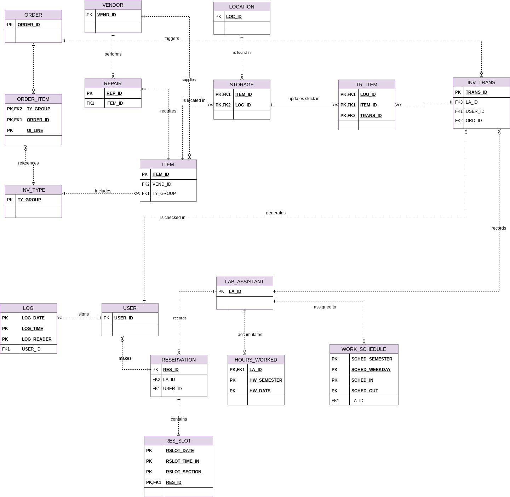

# Logical And Physical Design

#### Design Organization

#### Modules

Lab Management System:

    ENTITIES:

        - USER

        - LOG
        
        - LAB_ASSISTANT

        - WORK_SCHEDULE

        - HOURS_WORKED

        - RESERVATION

        - RES_SLOT

    Attribute Prefix:

        - USER_

        - LOG_

        - LA_

        - SCHED_

        - HW_

        - RES_

        - RSLOT_

Inventory Management System:

    ENTITIES:
        
        - INV_TYPE

        - ITEM

        - STORAGE

        - LOCATION

        - REPAIR

        - VENDOR

        - ORDER

        - ORDER_ITEM

        - WITHDRAW

        - WD_ITEM

        - CHECK_OUT

        - CHECK_OUT_ITEM

        - INV_TRANS

        - TR_ITEM

    Attribute Prefix:

        - TY_

        - ITEM_

        - STOR_

        - LOC_

        - REP_

        - VEND_

        - ORD_

        - OI_

        - WD_

        - WI_

        - CO_

        - CI_

        - TRANS_

        - TI_
        
#### Verified Conceptual ERD

