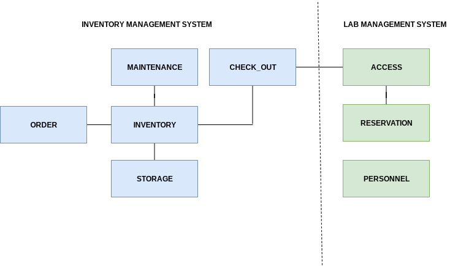

# Initial Study University Computer Lab

#### To Interview

    - The assistant dean (dean) of the College of Business.

    - The computer lab director (CLD), who is charged with the Lab’s operational
      management.

    -  The computer lab assistants (LAs), who are charged with the Lab’s daily operations

    - The computer lab secretary (CLS), who assists in the Lab’s general administrative
      functions.

    - The computer lab’s graduate assistants (GAs), who work under the lab director
      to provide technical support and training to faculty and staff using the College of
      Business resources.

#### UCL Objectives

The University Computer Lab (UCL) is in a central location on campus and is acces-
sible by all university students regardless of major. The UCL provides access to many
resources, including 200 computers, laser printers, and scanners, to all university mem-
bers. The UCL provides service and support to a group of users composed of faculty,
staff, and students. The Lab’s objectives are to:

    - Provide users with controlled access to the UCL’s assets, such as computers, printers,
      supplies, application software, and software documentation.

    - Guide users working with the UCL’s assets and provide general problem-solving services. Those services are primarily designed to help users with basic computing operations, 
      such as disk formatting, file copying, (approved), software installation, and
      basic startup and shutdown procedures.

#### Description of Operations

    - Inventory/Storage/Order Management

    - Equipment Maintenance

    - Repair Management

    - Equipment Check-Out

    - Check-In Management

    - Lab Assistant Payroll Management

    - Lab Reservations Management

    - Lab Access Management

#### Inventory/Storage/Order Management Business Process Items

The Below items are the things thats flow through the inventory/storage/order management process
that needs to be recorded and tracked.

    - Hardware includes computers, terminals, printers

    - Software includes all application programs, such as spreadsheets, word-processing
      software, statistical software, and database software.

    - Literature includes reference texts and software manuals.

    - Supplies include all consumables, such as printer ribbons and paper

Each inventory item is classified by inventory type, and inventory type is used to group
all similiar items.

The inventory’s items are updated when:

    - An ordered item is received.

    - An item is checked out of inventory or checked into inventory by a lab user.

    - A consumable item (such as paper or an ink cartridge) is withdrawn from inventory
      for use

    - The CLD adjusts the inventory. For example, if a physical inventory check reveals
      that a box of paper is missing, the quantity on hand for that item must be adjusted.

#### Check-Out Check-In Process

“Only professors or staff members may borrow equipment from the Lab. In order to keep
a record of equipment location and use, the CLD must check out the equipment. The
professor who wants to borrow the equipment must fill out the appropriate form before
removing any equipment. The check-out form requires the user to supply a date-out and
an estimated date-in. If the equipment has not been returned by the date-in deadline, a
notice is sent to the professor whose name appears on the check-out form. Student man-
uals and data disks may not be borrowed; they are for use only in the Lab.”

#### Equipment Maintenance and Repair Management Process

If a piece of equipment requires maintenance, the CLD generates an entry in the Bad
Equipment Log. If the equipment must be returned to the vendor for repair, the CLD
makes an entry in the Hardware Returned for Service Log.

#### Lab Assistant Payroll Management Process

 The UCL pays lab assistants (LAs) on an hourly
basis and keeps track of the total hours worked by each LA during each 14-day pay
period. Each LA is assigned a work schedule (the dates and times each LA must work)
and must submit a time sheet (showing the hours actually worked) before a paycheck can
be issued. The CLD reviews the time sheets and sends them to the payroll department
for further processing. Graduate assistants (GAs) are paid a monthly stipend and work a
fixed number of hours per week; they are not included in payroll calculations.

#### Lab Reservations Management Process

 The UCL can be reserved by faculty members for
teaching purposes. A faculty member fills out a reservation form to reserve the Lab,
specifying the date, time, department, and course number of the class to be taught. If an
instructor reserves the Lab for a small class, students not enrolled in that class may use
the remaining unoccupied computers at the instructor’s discretion.

#### Computer Lab Access Management Process

The UCL is used by students, faculty, and staff
members. Upon entering the UCL, the user signs the users’ log, located at the LA’s desk,
and leaves a (valid) University ID card with the LA. When the user leaves the UCL, the
LA makes sure that all items checked out by the user (for example, manuals and instruc-
tors’ data disks) have been returned. If all items have been returned, the LA returns the
ID to the user and the user signs out in the log. As long as the UCL is open, there are no
time restrictions placed on the user, except when the UCL is reserved for a class.

#### Information Log

    Lab assistants 14 per semester

    Work schedule 8 hours per workday per lab assistant

    Hours worked 1 (total hours summary) entry per pay period per lab assistant

    Users
        
        Faculty 300
        
        Students 15000

        Staff 650

    Reservations 4 per week

    Daily lab users 570 per day

    Orders 20 per month

    Items ordered 3 per order

    Inventory types 15

    Locations 5

    Repairs 20 per month

    Vendors 40

#### Time Frame

    - The College of Business wants the new system to be fully operational within three
      months.

#### Hardware and Software

    - The new system must be developed (to the extent possible) with existing UCL hardware and 
      software. The system must be operated on the UCL’s existing local area network. 

#### Distributed Aspects and Expandability

    - The new system must operate within a multiuser environment.

    - The system’s operation will be independent of existing administrative systems on campus.

## System Objectives

#### Business Requirements

    - Improve operational efficiency, thereby increasing the UCL’s capacity and the UCL’s
      ability to expand its operations.

    - Provide useful information for planning, control, and security

#### Inventory/Storage/Order Management Requirements

    - Provide better control of purchase orders, allowing the CLD to check open orders and
      purchases.

    - Monitor the stock of supply items.

    - Control inventory by type (group) as well as by individual item.

    -  Provide quick and efficient information about the location and status of individual
       items.

    - Provide timely information about the use of supplies and generate the statistical 
      information required to guide the timing and extent of future purchases.

#### Equipment Maintenance and Repair Management

    - Monitor the maintenance history of each item.

    - Keep track of items that have been returned to the vendor for repair or replacement.

#### Equipment Check-Out/Check-In Management

    - Keep track of the items that are checked out.

    - Monitor the items’ check-out time.

    - Generate usage statistics for reference purposes.

#### Lab Assistant Payroll Management

    - Provide scheduling and workload information.

    - Provide work summaries for each LA.

#### Lab Reservations Management

    - Decrease the time spent processing a reservation.

    - Produce reservation schedules.

    - Generate statistical summaries by department, faculty, staff member, and date (to be
      used for planning purposes).

#### Computer Lab Access Management

    - Provide tighter control over users and resources in the Lab.

    - Reduce the sign-in time.

    - Provide information about peak use times (to be used for scheduling purposes).

#### System Modules

    - Lab Management System
   
    - Inventory Management System

#### System Model

The INVENTORY process must permit:

    - Registering new inventory types and individual items.
    - Keeping track of an item’s location, classification, and usage.

The INVENTORY process will interface with the ORDER, STORAGE, MAINTENANCE, and CHECK_OUT processes.

The ORDER process tracks types of inventory items that are ordered from vendors.

The system will be designed to track the purchase orders and requisitions placed by the
UCL. The ORDER process will interface with the INVENTORY process.

The MAINTENANCE process will track the in-house repairs performed on items, as
well as track items returned to the vendor for repair. The MAINTENANCE process also
interfaces with the INVENTORY process because items found in inventory may have a
repair history.

The CHECK_OUT process will track the items that are checked out by the Lab’s users:
faculty, staff, and students.

The ACCESS process will help the CLD track the Lab’s users. The ACCESS process
will interface with the CHECK_OUT process because some items are checked out by
students, faculty, or staff members.

The RESERVATION process will track Lab reservations made by faculty or staff members. The process interfaces with:

    - ACCESS (because faculty members reserve the Lab).
    - PERSONNEL (because an LA records the reservation).

The PERSONNEL process will facilitate the CLD’s ability to monitor the LAs’ work
schedules and actual hours worked. This process interfaces with the RESERVATION
process because LAs record Lab reservations.
